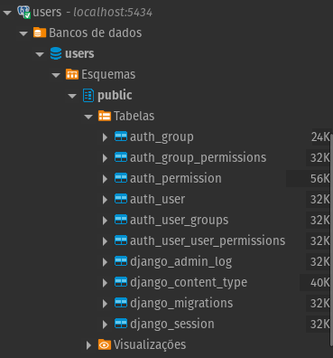

# Multiplos Databases em Django

Este projeto tem como objetivo gerenciar um projeto Django usando mais de um BD (Database) no projeto.

### Clone e iniciar aplicação:

```commandline
git clone https://github.com/victoraugusto6/django-multiple-databases

cd django-multiple-databases

python -m venv .venv

source .venv/bin/activate

pip install -r requirements-dev.txt

python manage.py runserver
```

### Realizar migrações:

```commandline
python manage.py migrate

python manage.py migrate --database=auth_db
```

### Criar usuário (Em BD separado):

```commandline
python manage.py createsuperuser --database=auth_db
```

---

## Demonstração:


O modelo `Task` está sendo armazenado apenas no banco `default`.



Enquanto os dados de usuários são separados em outro DB, em `users`.
